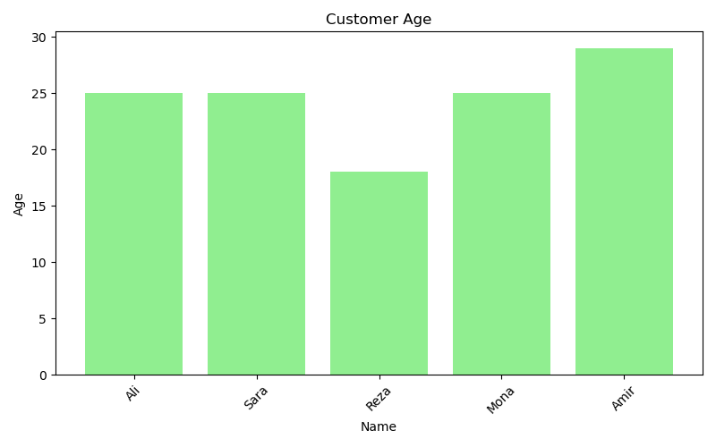

# Customer Data Analysis

**Junior Data Analyst Project**  
Real-world data cleaning + visualization using **Pandas & Matplotlib**

## What I Did
1. Loaded customer data (hardcoded for demo)
2. Cleaned: missing values, negative income, invalid age, duplicates
3. Visualized income and age

## Results
- Cleaned dataset: **5 unique customers**
- Plots:

## Run
Open `customer_analysis.ipynb` in Jupyter or VS Code

---
*PhD in Pure Math → Learning Data Science*
